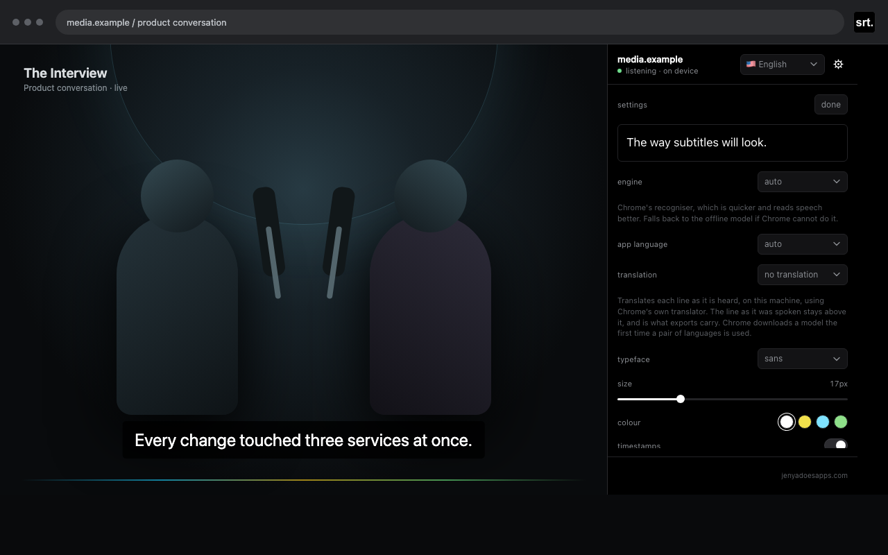

# Tab Subtitles

Live captions for audio playing in a Chrome tab. Subtitles appear in the side panel and can optionally be shown over the page or fullscreen video.

## Live captions


## Settings



## Features

- Chrome Speech Recognition for quick startup
- Optional on-device Whisper transcription
- Speaker separation and speaker colors, on by default
- Spoken language picked from the panel, switchable mid-session
- Optional live translation on device, shown above the original line
- Adjustable typeface, size, color, and timestamps
- TXT, SRT, and VTT export
- No account, advertising, analytics, or cloud storage

## Install locally

```bash
npm install
npm run build
```

Then:

1. Open `chrome://extensions`.
2. Enable **Developer mode**.
3. Select **Load unpacked**.
4. Choose this project's `dist` directory.
5. Click the extension icon on a tab that is playing audio.

Chrome requires the toolbar click before an extension can capture a tab. Protected Chrome pages and some DRM media cannot be captured.

## Recognition and privacy

| Mode | Processing |
| --- | --- |
| Auto | Uses Chrome recognition first and falls back to Whisper if unavailable. |
| Chrome | May send tab audio to Google unless Chrome has its on-device language model installed. |
| Offline model | Runs Whisper locally in the browser after an approximately 150 MB model download. |

Translation uses Chrome's built-in Translator API (Chrome 138+). It runs on this machine once the language pair's model has been downloaded, and the transcript keeps the original: exports and copied lines are the words as they were spoken.

Speaker separation is on by default and can be switched off in settings. It downloads an approximately 7 MB model on first use and processes speaker embeddings locally.

The developer does not receive audio or transcripts. Transcripts remain in extension memory for the active session unless the user copies or exports them. See [PRIVACY.md](PRIVACY.md) for the complete policy.

## Development

```bash
npm test          # unit tests
npm run typecheck # TypeScript validation
npm run dev       # development build in watch mode
npm run release   # build, test, validate assets, and create the store ZIP
```

The production extension is built into `dist/`. The Chrome Web Store upload archive is generated under `release/`.

Store listing copy, permission justifications, asset paths, and the submission checklist are in [CHROMEWEBSTORE.md](CHROMEWEBSTORE.md).
