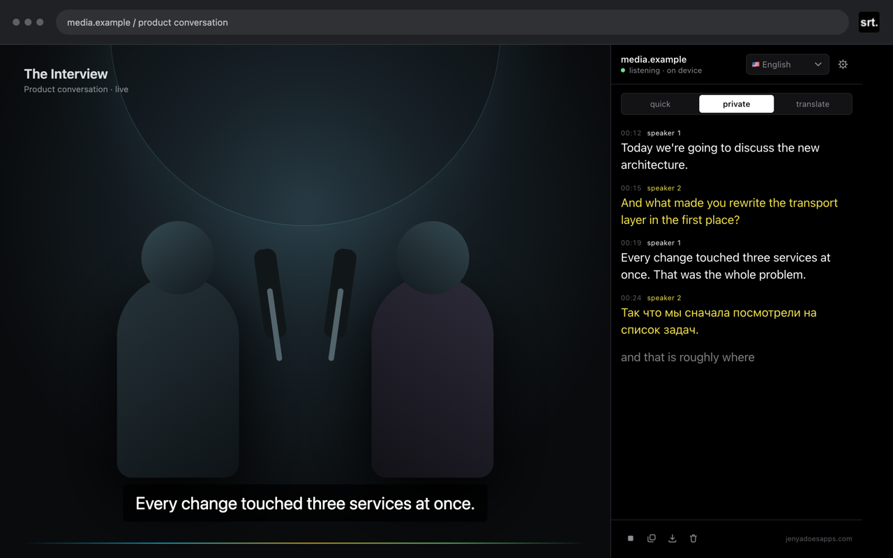
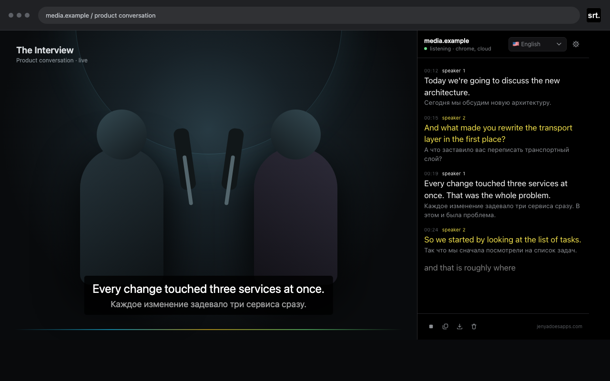

<div align="center">

# Tab Subtitles

### Private captions for your browser

Videos, meetings, podcasts and streams — transcribed and translated on your own machine.

[](https://chromewebstore.google.com/detail/tab-subtitles/egbheogpojgfgidcjffloaepeefbfobd)
&nbsp;
[](https://github.com/hypnagonia/tab-subtitles)

<table>
  <tr>
    <td width="50%"></td>
    <td width="50%"></td>
  </tr>
  <tr>
    <td align="center"><sub><b>offline model</b> — nothing leaves the machine</sub></td>
    <td align="center"><sub><b>translation</b> — under each line, on this machine</sub></td>
  </tr>
</table>

</div>

## Engine and translation

Which recogniser listens, and whether anything is translated, are chosen in settings, behind the gear.

| Engine | What you get |
| --- | --- |
| **auto** | The fastest way to captions. Chrome listens, and the offline model steps in when it cannot. |
| **chrome** | Chrome's own recogniser only. It uses Google's servers unless Chrome's on-device model is installed. |
| **offline model** | Captions made on this machine and nowhere else, by Whisper in the browser. The first run downloads about 150 MB. |

Translation is its own setting: pick a language and each line is translated on this machine, shown under the words as they were spoken. Typeface, size, colour, timestamps, speaker colours, and the on-page overlay live behind the gear too. Only the spoken language sits in the panel itself, so it can be changed mid-session.

## Features

- Live captions in the side panel, in 17 spoken languages
- Optional captions over the page and in fullscreen video
- Speaker separation and speaker colours, on by default
- Spoken language picked from the panel, switchable mid-session
- On-device translation, shown under the original line
- Adjustable typeface, size, colour, and timestamps
- TXT, SRT, and VTT export
- No account, advertising, analytics, or cloud storage

## Recognition and privacy

| Engine | Processing |
| --- | --- |
| auto | Chrome recognition first, which may send tab audio to Google unless Chrome's on-device language model is installed. Falls back to Whisper. |
| chrome | Chrome recognition only, which may send tab audio to Google unless Chrome's on-device language model is installed. |
| offline model | Whisper only, in this browser, after an approximately 150 MB model download. Nothing leaves the machine. |

Translation uses Chrome's built-in Translator API (Chrome 138+). It runs locally once the language pair's model has been downloaded, and the transcript keeps the original: exports and copied lines are the words as they were spoken.

Speaker separation is on by default and can be switched off in settings. It downloads an approximately 7 MB model on first use and processes speaker embeddings locally.

The developer does not receive audio or transcripts. Transcripts remain in extension memory for the active session unless the user copies or exports them. See [PRIVACY.md](PRIVACY.md) for the complete policy.

## Install locally

```bash
npm install
npm run build
```

Then:

1. Open `chrome://extensions`.
2. Enable **Developer mode**.
3. Select **Load unpacked**.
4. Choose this project's `dist` directory.
5. Click the extension icon on a tab that is playing audio.

Chrome requires the toolbar click before an extension can capture a tab. Protected Chrome pages and some DRM media cannot be captured.

## Development

```bash
npm test          # unit tests
npm run typecheck # TypeScript validation
npm run dev       # development build in watch mode
npm run release   # build, test, validate assets, and create the store ZIP
```

The production extension is built into `dist/`. The Chrome Web Store upload archive is generated under `release/`.

Store listing copy, permission justifications, asset paths, and the submission checklist are in [CHROMEWEBSTORE.md](CHROMEWEBSTORE.md).
